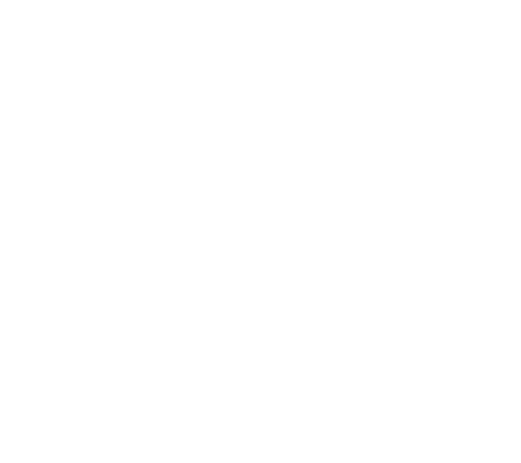
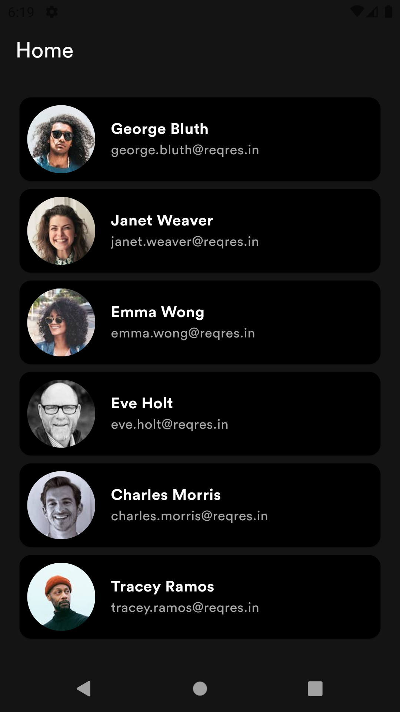

[![Contributors][contributors-shield]][contributors-url]
[![LinkedIn][linkedin-shield]][linkedin-url]

<!-- PROJECT LOGO -->
 

  

  <h3 align="center">Ash Story</h3>

  

    User List App
     
  

<!-- TABLE OF CONTENTS -->
<!-- 

  
Table of Contents

  <ol>
    <li>
      <a href="#about-the-project">About The Project</a>
      <ul>
        <li><a href="#built-with">Built With</a></li>
      </ul>
    </li>
    <li><a href="#contributing">Contributing</a></li>
    <li><a href="#contact">Contact</a></li>
  </ol>

 -->

<!-- ABOUT THE PROJECT -->
## About The Project

This project just to complete the task given from company

**Key Features:**
- Navigation: Go_Router ensures smooth and efficient navigation between app screens.
- State Management: Bloc Cubit provides a reactive approach to manage states effectively.
- Service Locator: Using get it for service locator to make code cleaner

**Screenshots App:**

  
| Splash Screen | Home Screen | Detail Screen |
|:--------------:|:------------:|:---------------:|
|  |  |  |

### Built With

**Framework:**
* [![Flutter][Flutter]][Flutter-url]

**Library and Technology:**
* [![Dio][Dio]][Dio-url]
* [![Bloc-Cubit][Bloc]][Bloc-url]
* [![Go-Router][Go-Router]][Go-Router-url]

<!-- CONRTIBUTORS -->
### Contributors:

<!-- 
(<a href="#readme-top">back to top</a>)
 -->

<!-- CONTACT -->
## Contact

Ja'far - ajib.aiwa@gmail.com

<!-- MARKDOWN LINKS & IMAGES -->
<!-- https://www.markdownguide.org/basic-syntax/#reference-style-links -->
[contributors-shield]: https://img.shields.io/github/contributors/jafar144/ReqresFlutter.svg?style=for-the-badge
[contributors-url]: https://github.com/othneildrew/Best-README-Template/graphs/contributors
[linkedin-shield]: https://img.shields.io/badge/-LinkedIn-black.svg?style=for-the-badge&logo=linkedin&colorB=555
[linkedin-url]: https://www.linkedin.com/in/jafarrmu/
[product-screenshot]: images/screenshot.png
[Flutter]: https://img.shields.io/badge/Flutter-20232A?style=for-the-badge&logo=flutter&logoColor=61DAFB
[Flutter-url]: https://flutter.dev/
[Dio]: https://img.shields.io/badge/Dio-20232A?style=for-the-badge&logo=dio&logoColor=61DAFB
[Dio-url]: https://pub.dev/packages/dio
[Bloc]: https://img.shields.io/badge/Bloc--Cubit-20232A?style=for-the-badge&logo=bloc&logoColor=61DAFB
[Bloc-url]: https://pub.dev/packages/bloc
[Go-Router]: https://img.shields.io/badge/Go--Router-20232A?style=for-the-badge&logo=bloc&logoColor=61DAFB
[Go-Router-url]: https://pub.dev/packages/go_router
